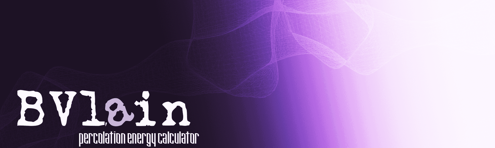

BVlain is a python library for bond valence site energy calculations. The functionality includes calculation of the 1-3D percolation barrier and radius of a mobile ion (e.g. Li+), calculation of the bond valence sum mismatch, writing of volumetric data files (.grd or .cube) for visualization of a mobile ion diffusion map. 

For more details, see [documentation.](https://bvlain.readthedocs.io/en/latest/index.html)


## Installation


```python
pip install bvlain
```

## Examples

##### Percolation barriers


```python
from bvlain import Lain

file = './Downloads/LiFePO4.cif'
calc = Lain(verbose = False)
atoms = calc.read_file(file)       # alternatively, you can use read_atoms() or read_structure()

params = {'mobile_ion': 'Li1+',    # mobile specie
		  'r_cut': 10.0,           # cutoff for interaction between the mobile species and framework
		  'resolution': 0.2,	   # distance between the grid points
		  'k': 100                 # maximum number of neighbors to be collected for each point
}
_ = calc.bvse_distribution(**params)
energies = calc.percolation_barriers(encut = 5.0)
for key in energies.keys():
    print(f'{key[-2:]} percolation barrier is {round(energies[key], 4)} eV')
```

    1D percolation barrier is 0.4395 eV
    2D percolation barrier is 3.3301 eV
    3D percolation barrier is 3.3594 eV


##### Save volumetric data for visualization (.grd or .cube)


```python
from bvlain import Lain

file = './Downloads/LiFePO4.cif'
calc = Lain(verbose = False)
atoms = calc.read_file(file)

params = {'mobile_ion': 'Li1+',    # mobile specie
		  'r_cut': 10.0,           # cutoff for interaction between the mobile species and framework
		  'resolution': 0.2,	   # distance between the grid points
		  'k': 100                 # maximum number of neighbors to be collected for each point
}
_ = calc.bvse_distribution(**params)

calc.write_grd(file + '_bvse', task = 'bvse')  # saves .grd file
# calc.write_cube(file + '_bvse', task = 'bvse') # alternatively, save .cube file
```

##### Percolation radii


```python
from bvlain import Lain

file = './Downloads/LiFePO4.cif'
calc = Lain(verbose = False)
atoms = calc.read_file(file)

params = {'mobile_ion': 'Li1+',    # mobile specie
		  'r_cut': 10.0,           # cutoff for interaction between the mobile species and framework
		  'resolution': 0.2,	   # distance between the grid points
}
_ = calc.void_distribution(**params)
radii = calc.percolation_radii()
for key in radii.keys():
    print(f'{key[-2:]} percolation barrier is {round(radii[key], 4)} angstrom')
```

    1D percolation barrier is 0.3943 angstrom
    2D percolation barrier is 0.2957 angstrom
    3D percolation barrier is 0.1972 angstrom

```python
calc.write_grd(file + '_void', task = 'void') # # save void distribution
```

##### Bond valence sum mismatch


```python
from bvlain import Lain

file = './Downloads/LiFePO4.cif'
calc = Lain(verbose = False)
atoms = calc.read_file(file)
dataframe = calc.mismatch(r_cut = 3.5)
```


For more examples, see [documentation.](https://bvlain.readthedocs.io/en/latest/index.html)

The library is under active development and it is not guaranteed that there are no bugs. If you observe not expected results, errors, please report an issue at github.


